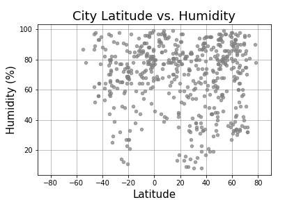
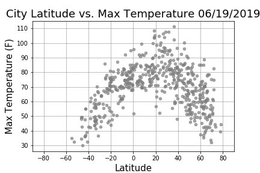

# WeatherPy
### Summary
This repository contains a Jupyter Notebook with the viewable Data Frames and a written description of observable trends based on data approaching the equator.
### Technical Details
In order to run the code, it is required: 
Python requests, OpenWeatherMap APIs, and JSON traversals 
The Matplotlib or Pandas plotting libraries 
### Screenshots
CityLatitudeVs.Cloudiness(%)06-19-2019.png 
06-19-2019.png)  
CityLatitudeVs.Humidity06-19-2019.png 
  
CityLatitudeVs.MaxTemperature06-19-2019.png 
  
CityLatitudeVs.WindSpeed(mph)06-19-2019.png 
06-19-2019.png)  
### Explanations 
The outcome is shown in screenshots for reference purpose of the public. 

# WeatherPy

Whether financial, political, or social -- data's true power lies in its ability to answer questions definitively. 
Answer a fundamental question: "What's the weather like as we approach the equator?"

WeatherPy
Create a Python script to visualise the weather of 500+ cities across the world of varying distance from the equator.
To accomplish this, you'll be utilizing a simple Python library, the OpenWeatherMap API, and a little common sense to create a representative model of weather across world cities.
Build a series of scatter plots to showcase the following relationships:

Temperature (F) vs. Latitude
Humidity (%) vs. Latitude
Cloudiness (%) vs. Latitude
Wind Speed (mph) vs. Latitude

The final notebook: 
Randomly selects at least 500 unique (non-repeat) cities based on latitude and longitude.
Performs a weather check on each of the cities using a series of successive API calls.
Includes a print log of each city as it's being processed with the city number and city name.
Saves both a CSV of all data retrieved and png images for each scatter plot.

A query pool uses the full gamut of latitudes and longitudes.
Simply rattling 500 cities based on a human selection would create a biased dataset, so, the full range of latitudes is considered.
